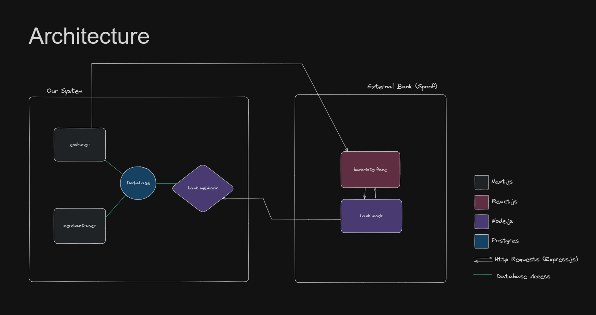
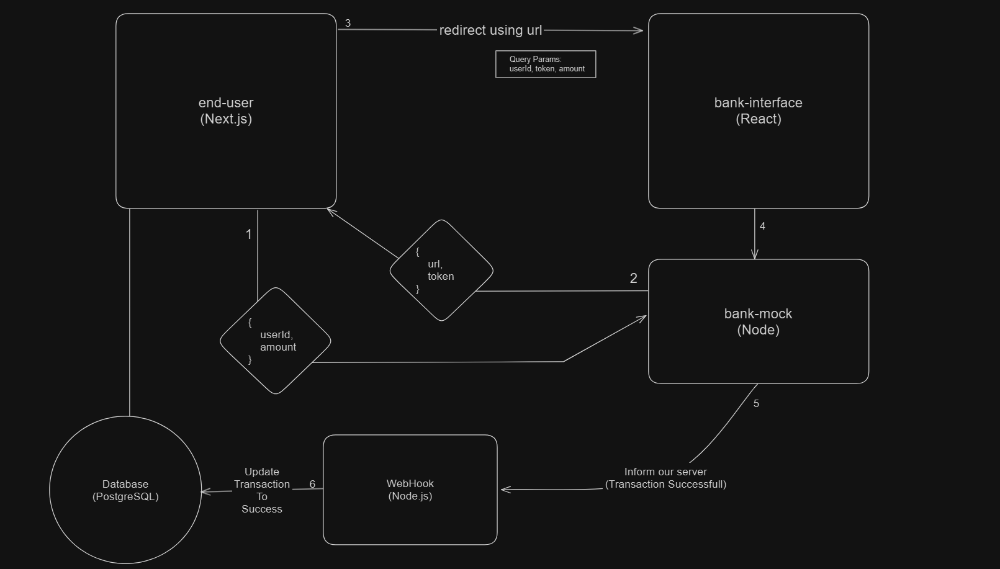
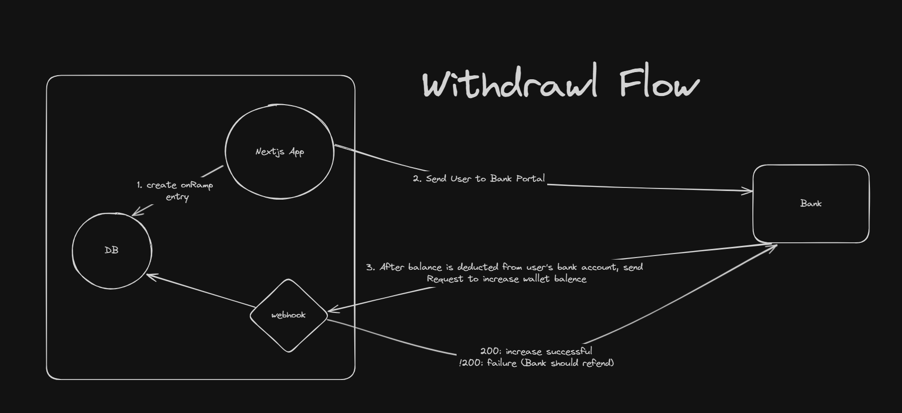
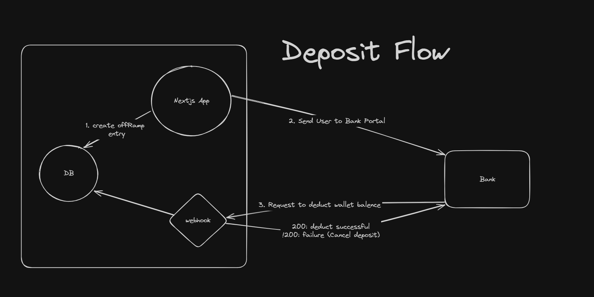
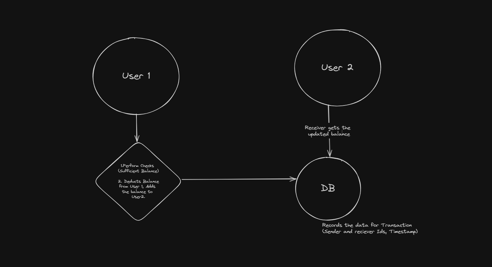
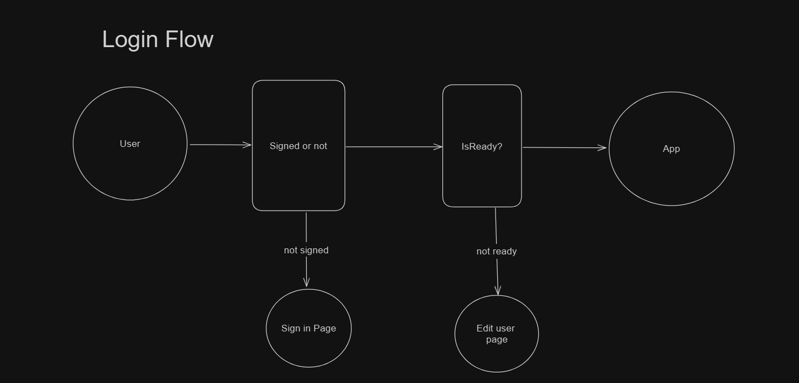
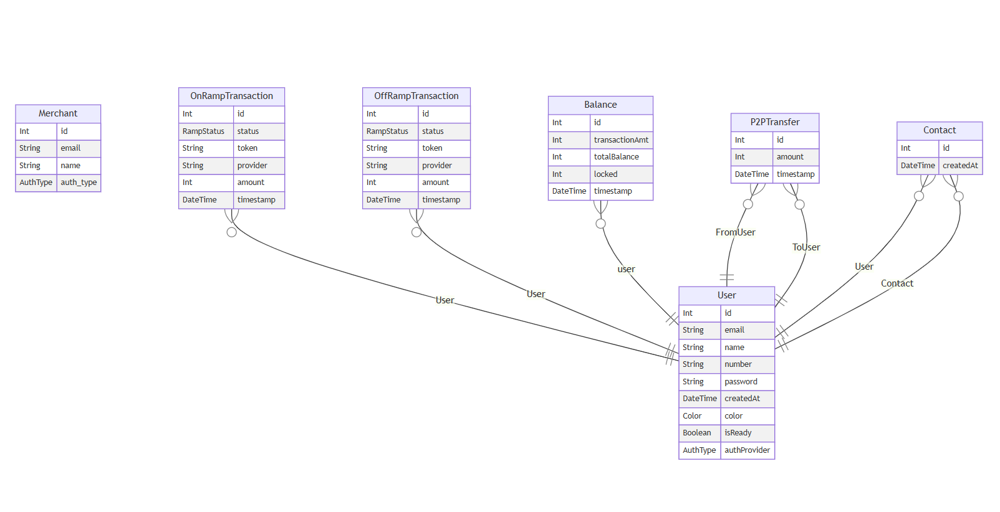

# eWallet System

This is repository contains web softwares for a eWallet system.

System aims to perform operations like a real e-wallet applications like PayTM, i.e, able to transfer funds from one user to another, deposit and withdraw funds from external banks, and track the movement of funds.

Here, I tried to spoof the external bank softwares, i.e, they mimicks like a bank software, but arent, they just play along to complete the flow of the application. 

## Architecture



### End User to Bank Communication



### Features

  - Add balance into Wallet (Withdraw)
  
    

  - Deposit wallet balance into Bank (Deposit)
  
    

  - P2P Wallet balance transfer
  
    

### Login Flow




### Schema

  

## Quick start

Run the following command to start all applications:

```sh
npm run dev
```

## What's inside?

This Turborepo includes the following packages/apps:

### Apps

- `end-user`: [Next.js](apps/end-user/) app for end users to use the wallet.
- `bank-webhook`: [Node.js](apps/bank-webhook/) app to receive requests from integrated banks.
- `bank-mock`: [Node.js](apps/bank-mock/) app to mimick a bank system.
- `bank-interface`: [React.js](apps/bank-interface/) app to mimick a bank user interface.

### Packages
- `@repo/ui`: [React.js](packages/ui/) component library that can be shared across apps.
- `@repo/common`: Utility folder containing common [TypeScript](packages/common/) modules and functions.
- `@repo/db`: Singleton [Prisma](packages/db/) client.
- `@repo/store`: Centeralised folder for [Recoil](packages/store/) hooks, atoms and selectors.

Each package/app is 100% Typescript.

[Excalidraw](https://excalidraw.com/#json=64FyRO6VSFQKsHQWlCylK,Jb3F5IV010z89Y5kg09fKQ)
